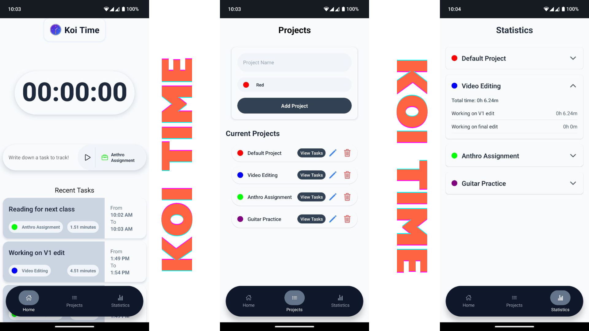

# KoiTime

KoiTime is a beautiful Expo-powered React Native application designed to help users efficiently track time spent on tasks and projects.

**Koi Time is still under development**



## 🚀 Tech Stack

- **Frontend:** React Native with Expo
- **State Management:** Redux
- **Local Database:** SQLite
- **UI Kit:** TWRNC

## 🔥 Key Features

- 📊 Track time for multiple projects and tasks
- ⏱️ Intuitive interface for starting and stopping timers
- 🏷️ Advanced task categorization with custom projects
- 📅 Comprehensive statistics for each project
- 🔒 Local data storage using SQLite

## 🛠️ Installation

1. Clone this repository:
   ```
   git clone https://github.com/safalbaral/KoiTime.git
   ```
2. Navigate to the project directory:
   ```
   cd TimeTracker
   ```
3. Install dependencies:
   ```
   npm i
   ```
4. Start the Expo development server:
   ```
   expo start
   ```

## 🖥️ Development

To run the app on a simulator/emulator:

- iOS Simulator: Press `i` in the terminal where Expo is running.
- Android Emulator: Press `a` in the terminal where Expo is running.

To run on a physical device, ensure your device and development machine are on the same WiFi network, then scan the QR code with the Expo Go app.

## 🏗️ Project Structure

```
TimeTracker/
├── src/
│   ├── components/
|       ├── BottomNavbar.tsx
|       ├── Dropdown.tsx
|       ├── Main.tsx
|       ├── PrimaryTimer.tsx
|       ├── ProjectForm.tsx
|       ├── ProjectList.tsx
|       ├── Projects.tsx
|       ├── RecentTasksList.tsx
|       ├── Statistics.tsx
|       ├── TaskBar.tsx
|       ├── TaskBarButtons.tsx
|       └── TasksView.tsx
│   ├── constants/
│   │   ├── constants.ts
│   ├── database/
│   │   ├── db.ts
│   ├── reducers/
│   │   ├── currentTaskReducer.ts
│   │   ├── timerReducer.ts
│   ├── utils/
│   │   └── formatted_data_utils.ts
│   │   └── time.ts
│   ├── hooks.ts
│   ├── store.ts
│   ├── theme.ts
│   ├── types.ts
├── .gitignore
├── app.json
├── App.tsx
├── babel.config.js
└── package.json
└── tsconfig.json
```

## 💾 Database Schema

The SQLite database uses the following schema:

```sql
      CREATE TABLE IF NOT EXISTS projects (
        id INTEGER PRIMARY KEY AUTOINCREMENT,
        name TEXT NOT NULL,
        is_archived INTEGER NOT NULL,
        color TEXT NOT NULL
      );

      CREATE TABLE IF NOT EXISTS tasks (
        id INTEGER PRIMARY KEY AUTOINCREMENT,
        name TEXT NOT NULL,
        project_id INTEGER,
        FOREIGN KEY (project_id) REFERENCES projects (id)
      );

      CREATE TABLE IF NOT EXISTS task_instances (
        id INTEGER PRIMARY KEY AUTOINCREMENT,
        task_id INTEGER,
        start_time INTEGER NOT NULL,
        end_time INTEGER,
        total_minutes INTEGER,
        FOREIGN KEY (task_id) REFERENCES tasks (id)
      );

      INSERT OR IGNORE INTO projects (id, name, is_archived, color)
      VALUES (1, 'Default Project', 0, '#FF0000');
```

## 🔧 Future Development Plans

- Implement tests for the entire application
- Fix bug in task statistics screen
- Avoid confusing UI patterns by graying out and locking the task bar when tasks are being tracked.
- Add data visualization with graphs
